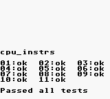
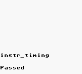
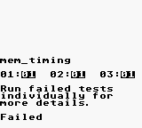
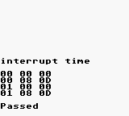
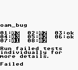

# Serverboy

Serverboy is a pure NodeJS headless Gameboy emulator with hooks for scripting
and streaming output, adapted for use by Piglet.

Serverboy has no dependencies, including browser-side dependencies like Canvas.
This makes Serverboy ideal for headless streaming and scripting via low-powered
environments and environments where users are not able to install additional
software dependencies like [Cairo](https://www.cairographics.org/).

Unlike most emulators, Serverboy's API is heavily geared towards automation and
serverside projects. Serverboy doesn't auto-advance frames, so you can step
forward frame by frame after running asynchronous logic. Serverboy also provides
hooks for getting raw memory access, raw screen pixels, and raw PCM audio data.

This focus on automation means that Serverboy is *not* generally suited for
regular play. There's no integrated code for displaying the screen or playing
audio. It's designed to be used *inside* other more experimental projects. If
you just want a way to play games, look elsewhere unless you're willing to build
your own front-end.

**Serverboy is alpha software; elements like sound are still a work in progress.**

# Integration Tests

Serverboy uses [Blargg's Test Roms](https://github.com/retrio/gb-test-roms) for
integration tests to ensure that simulation accuracy doesn't change during
code refactoring.

Serverboy doesn't guarantee complete emulation accuracy, just consistency with
the results below. More tests and accuracy changes may be added in the future.

    
    
    
    
    

# Credits

Serverboy is heavily based on work by
[rauchg](https://github.com/rauchg/gameboy), which is itself heavily based on
Grant Galitz's earlier work with [Gameboy
Online](https://github.com/taisel/GameBoy-Online). Most of this code originated
in Grant's repo, and I've mostly been playing janitor since.

Imran Nazar's article series, [Gameboy Emulation in
Javascript](http://imrannazar.com/GameBoy-Emulation-in-JavaScript:-The-CPU) was
also an occasional help when I wanted dig into the internals of how the hardware
actually worked to help with refactoring.
